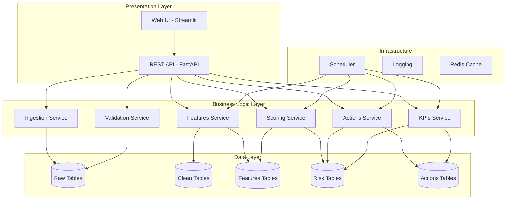

# Design Document: Expiry Risk Pipeline

## Overview

ThePerfectShop's expiry risk pipeline is a comprehensive data-driven system that transforms messy retail data into actionable insights for preventing inventory waste. The system follows a modular architecture with clear separation between data ingestion, risk analysis, action generation, and user interfaces.

The design emphasizes simplicity and reliability for the MVP while providing extensibility for future ML enhancements. The core philosophy is "baseline first, ML later" - establishing a working system with explainable business rules before adding predictive models.

## Architecture

The system follows a layered architecture with clear separation of concerns:



### Technology Stack

- **Backend API**: FastAPI with Uvicorn ASGI server
- **Database**: PostgreSQL with SQLAlchemy ORM
- **Data Processing**: Pandas for ETL operations
- **Caching**: Redis for performance optimization
- **UI**: Streamlit for rapid MVP development
- **Scheduling**: Python-based cron jobs or GitHub Actions
- **Testing**: pytest with property-based testing using Hypothesis

## Components and Interfaces

### 1. Data Ingestion Service

**Purpose**: Transform messy Excel/CSV uploads into clean, validated data

**Key Classes**:
- `FileUploadHandler`: Manages file uploads and initial validation
- `ColumnMapper`: Intelligent mapping of messy column names to schema
- `DataValidator`: Comprehensive validation with detailed error reporting
- `DataCleaner`: Standardizes formats, handles duplicates, fills missing values

**Core Interface**:
```python
class IngestionService:
    def upload_file(self, file: UploadFile, file_type: str) -> UploadResult
    def validate_data(self, upload_id: str) -> ValidationReport
    def process_upload(self, upload_id: str) -> ProcessingResult
    def get_data_health(self, upload_id: str) -> DataHealthReport
```

**Column Mapping Strategy**:
- Fuzzy string matching for common variations ("SKU Code" → "sku_id")
- Configurable mapping rules stored in database
- User confirmation for ambiguous mappings
- Learning from previous successful mappings

### 2. Features Service

**Purpose**: Compute sales velocities and behavioral patterns from clean data

**Key Calculations**:
- Rolling velocities: v7, v14, v30 (units per day)
- Volatility: Standard deviation of daily sales over 30 days
- Seasonality flags: Basic pattern detection for future ML enhancement
- Data completeness scores: Track data quality per store-SKU

**Core Interface**:
```python
class FeaturesService:
    def compute_velocities(self, store_id: str, sku_id: str, as_of_date: date) -> VelocityMetrics
    def update_all_features(self, as_of_date: date) -> FeatureUpdateResult
    def get_feature_completeness(self, store_id: str, sku_id: str) -> CompletenessScore
```

**Velocity Calculation Logic**:
- v7: Sum of units sold in last 7 days / 7
- v14: Sum of units sold in last 14 days / 14  
- v30: Sum of units sold in last 30 days / 30
- Handle missing days by adjusting denominator
- Flag insufficient data when < 50% of period has sales

### 3. Risk Scoring Service

**Purpose**: Calculate expiry risk scores using explainable business rules

**Risk Calculation Algorithm**:
1. **Days to Expiry**: `days_to_expiry = expiry_date - current_date`
2. **Expected Sales**: `expected_sales = v14 * days_to_expiry`
3. **At-Risk Units**: `at_risk_units = max(0, on_hand_qty - expected_sales)`
4. **At-Risk Value**: `at_risk_value = at_risk_units * unit_cost`
5. **Risk Score**: Composite score (0-100) based on:
   - At-risk ratio: `at_risk_units / on_hand_qty`
   - Urgency factor: `1 / max(1, days_to_expiry)`
   - Value factor: `log(1 + at_risk_value)`

**Core Interface**:
```python
class ScoringService:
    def score_batch(self, batch: InventoryBatch, features: VelocityMetrics) -> RiskScore
    def score_all_batches(self, snapshot_date: date) -> List[RiskScore]
    def get_risk_distribution(self, filters: RiskFilters) -> RiskDistribution
```

### 4. Actions Service

**Purpose**: Generate transfer and markdown recommendations with savings estimates

**Transfer Logic**:
1. Identify stores with higher velocity for same SKU
2. Calculate destination absorption capacity: `v14_dest * days_to_expiry - current_stock_dest`
3. Recommend transfer quantity: `min(at_risk_units_source, max(0, absorption_capacity))`
4. Estimate savings: `transfer_qty * unit_cost - transfer_cost`

**Markdown Logic**:
1. Determine discount based on risk severity:
   - Low risk (score 0-30): 5% discount
   - Medium risk (score 31-60): 10% discount  
   - High risk (score 61-100): 15-25% discount
2. Estimate demand uplift using configurable multipliers
3. Calculate expected recovery: `discounted_price * expected_uplift_qty`

**Core Interface**:
```python
class ActionsService:
    def generate_transfer_actions(self, risk_scores: List[RiskScore]) -> List[TransferAction]
    def generate_markdown_actions(self, risk_scores: List[RiskScore]) -> List[MarkdownAction]
    def estimate_savings(self, action: Action) -> SavingsEstimate
    def update_action_status(self, action_id: str, status: ActionStatus) -> ActionResult
```

### 5. KPIs Service

**Purpose**: Track financial impact and system effectiveness

**Key Metrics**:
- Total at-risk value across all inventory
- Proposed savings from pending actions
- Realized savings from completed actions
- Action completion rates and cycle times
- Data quality scores and coverage

**Core Interface**:
```python
class KPIsService:
    def calculate_at_risk_value(self, filters: KPIFilters) -> AtRiskMetrics
    def calculate_savings_metrics(self, time_range: DateRange) -> SavingsMetrics
    def get_action_performance(self, time_range: DateRange) -> ActionPerformance
    def generate_executive_summary(self, time_range: DateRange) -> ExecutiveSummary
```

## Data Models

### Raw Data Tables

**raw_uploads**
- `id`: Primary key
- `uploaded_at`: Timestamp
- `file_name`: Original filename
- `file_type`: CSV/EXCEL
- `status`: UPLOADED/PROCESSING/COMPLETED/FAILED
- `validation_report`: JSON with validation results

**sales_daily** (cleaned from uploads)
- `date`: Sales date
- `store_id`: Store identifier
- `sku_id`: Product identifier  
- `units_sold`: Quantity sold
- `selling_price`: Price per unit (optional)

**inventory_batches** (cleaned from uploads)
- `snapshot_date`: Inventory snapshot date
- `store_id`: Store identifier
- `sku_id`: Product identifier
- `batch_id`: Batch/lot identifier
- `expiry_date`: Product expiry date
- `on_hand_qty`: Current inventory quantity

**purchases** (cleaned from uploads)
- `received_date`: Date received
- `store_id`: Store identifier
- `sku_id`: Product identifier
- `batch_id`: Batch/lot identifier
- `received_qty`: Quantity received
- `unit_cost`: Cost per unit

### Master Data Tables

**store_master**
- `store_id`: Primary key
- `city`: Store location
- `zone`: Regional grouping (optional)

**sku_master**
- `sku_id`: Primary key
- `category`: Product category
- `mrp`: Maximum retail price (optional)

### Computed Tables

**features_store_sku**
- `date`: Feature calculation date
- `store_id`: Store identifier
- `sku_id`: Product identifier
- `v7`: 7-day rolling velocity
- `v14`: 14-day rolling velocity
- `v30`: 30-day rolling velocity
- `volatility`: Sales volatility measure
- `seasonality_flags`: JSON with seasonal patterns

**batch_risk**
- `snapshot_date`: Risk calculation date
- `store_id`: Store identifier
- `sku_id`: Product identifier
- `batch_id`: Batch identifier
- `days_to_expiry`: Days until expiry
- `expected_sales_to_expiry`: Predicted sales before expiry
- `at_risk_units`: Units unlikely to sell
- `at_risk_value`: Value of at-risk inventory
- `risk_score`: Composite risk score (0-100)

**actions**
- `action_id`: Primary key
- `created_at`: Action creation timestamp
- `action_type`: TRANSFER/MARKDOWN
- `from_store`: Source store
- `to_store`: Destination store (nullable for markdowns)
- `sku_id`: Product identifier
- `batch_id`: Batch identifier
- `qty`: Recommended quantity
- `discount_pct`: Discount percentage (nullable for transfers)
- `expected_savings`: Estimated financial benefit
- `status`: PROPOSED/APPROVED/DONE/REJECTED

**action_outcomes**
- `action_id`: Foreign key to actions
- `measured_at`: Outcome measurement date
- `recovered_value`: Actual financial recovery
- `cleared_units`: Units actually sold/transferred
- `notes`: Additional outcome details

## Correctness Properties

*A property is a characteristic or behavior that should hold true across all valid executions of a system-essentially, a formal statement about what the system should do. Properties serve as the bridge between human-readable specifications and machine-verifiable correctness guarantees.*

<function_calls>
<invoke name="prework">
<parameter name="featureName">expiry-risk-pipeline