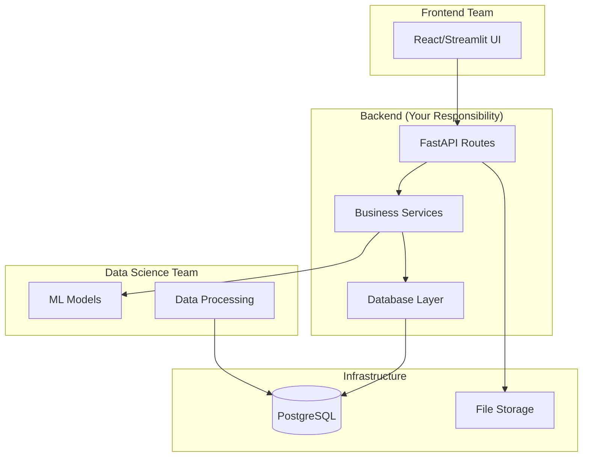

# Design Document: ExpiryShield Backend

## Overview

The ExpiryShield backend is a FastAPI-based REST service that serves as the core business logic layer for the inventory expiry prevention system. It provides a clean API interface for the frontend team while integrating with ML models from the data science team. The backend handles all data operations, business rule processing, and maintains the system's state in a PostgreSQL database.

The architecture follows a layered approach with clear separation between API routes, business services, and data access layers. This design enables independent development by team members while maintaining clean interfaces between components.

## Architecture



## Components and Interfaces

### API Layer (`app/api/`)

**Upload Routes (`routes_upload.py`)**
- `POST /upload` - Accept CSV/Excel files with validation
- `GET /upload/{upload_id}/status` - Check processing status
- `GET /upload/{upload_id}/report` - Get data health report

**Risk Analysis Routes (`routes_risk.py`)**
- `GET /risk` - List batches at risk of expiry
- `GET /risk/summary` - Risk summary by store/category
- `POST /risk/refresh` - Trigger risk recalculation

**Action Routes (`routes_actions.py`)**
- `POST /actions/generate` - Generate action recommendations
- `GET /actions` - List pending/approved actions
- `POST /actions/{action_id}/approve` - Approve an action
- `POST /actions/{action_id}/complete` - Mark action as done

**KPI Routes (`routes_kpis.py`)**
- `GET /kpis/dashboard` - Main dashboard metrics
- `GET /kpis/savings` - Savings tracking over time
- `GET /kpis/inventory` - Inventory health metrics

### Service Layer (`app/services/`)

**Ingestion Service (`ingestion.py`)**
- File parsing and validation
- Column mapping and normalization
- Data quality checks and reporting
- Integration with data processing team's outputs

**Feature Service (`features.py`)**
- Sales velocity calculations (7/14/30 day rolling averages)
- Seasonality and volatility metrics
- Store-SKU performance profiling
- Interface with ML team's feature engineering

**Scoring Service (`scoring.py`)**
- Risk score calculation using business rules
- Integration with ML model predictions
- Batch-level risk assessment
- Expected sales forecasting

**Action Service (`actions.py`)**
- Transfer recommendation logic
- Markdown optimization
- Liquidation value estimation
- Constraint handling (transfer costs, store capacity)

**KPI Service (`kpis.py`)**
- Savings calculation and tracking
- Performance metric aggregation
- Trend analysis and reporting
- ROI measurement

### Database Layer (`app/db/`)

**Models (`models.py`)**
- SQLAlchemy ORM models for all tables
- Relationships and constraints
- Indexing for performance

**Schemas (`schemas.py`)**
- Pydantic models for API request/response
- Data validation and serialization
- Type safety across the application

**Session Management (`session.py`)**
- Database connection handling
- Transaction management
- Connection pooling configuration

## Data Models

### Core Tables

```sql
-- Raw data from uploads
raw_uploads (
    id SERIAL PRIMARY KEY,
    uploaded_at TIMESTAMP,
    file_name VARCHAR(255),
    file_type VARCHAR(50),
    status VARCHAR(50)
);

-- Clean sales data
sales_daily (
    date DATE,
    store_id VARCHAR(50),
    sku_id VARCHAR(100),
    units_sold INTEGER,
    selling_price DECIMAL(10,2),
    PRIMARY KEY (date, store_id, sku_id)
);

-- Inventory by batch
inventory_batches (
    snapshot_date DATE,
    store_id VARCHAR(50),
    sku_id VARCHAR(100),
    batch_id VARCHAR(100),
    expiry_date DATE,
    on_hand_qty INTEGER,
    PRIMARY KEY (snapshot_date, store_id, sku_id, batch_id)
);

-- Purchase history
purchases (
    received_date DATE,
    store_id VARCHAR(50),
    sku_id VARCHAR(100),
    batch_id VARCHAR(100),
    received_qty INTEGER,
    unit_cost DECIMAL(10,2)
);

-- Master data
store_master (
    store_id VARCHAR(50) PRIMARY KEY,
    city VARCHAR(100),
    zone VARCHAR(50)
);

sku_master (
    sku_id VARCHAR(100) PRIMARY KEY,
    category VARCHAR(100),
    mrp DECIMAL(10,2)
);
```

### Analytics Tables

```sql
-- Computed features
features_store_sku (
    date DATE,
    store_id VARCHAR(50),
    sku_id VARCHAR(100),
    velocity_7d DECIMAL(8,2),
    velocity_14d DECIMAL(8,2),
    velocity_30d DECIMAL(8,2),
    volatility DECIMAL(6,4),
    seasonality_flag BOOLEAN,
    PRIMARY KEY (date, store_id, sku_id)
);

-- Risk assessment
batch_risk (
    snapshot_date DATE,
    store_id VARCHAR(50),
    sku_id VARCHAR(100),
    batch_id VARCHAR(100),
    days_to_expiry INTEGER,
    expected_sales_to_expiry DECIMAL(8,2),
    at_risk_units INTEGER,
    at_risk_value DECIMAL(12,2),
    risk_score INTEGER,
    PRIMARY KEY (snapshot_date, store_id, sku_id, batch_id)
);

-- Action recommendations
actions (
    action_id SERIAL PRIMARY KEY,
    created_at TIMESTAMP,
    action_type VARCHAR(20), -- TRANSFER, MARKDOWN, LIQUIDATE
    from_store VARCHAR(50),
    to_store VARCHAR(50),
    sku_id VARCHAR(100),
    batch_id VARCHAR(100),
    qty INTEGER,
    discount_pct DECIMAL(5,2),
    expected_savings DECIMAL(12,2),
    status VARCHAR(20) -- PROPOSED, APPROVED, DONE, REJECTED
);

-- Outcomes tracking
action_outcomes (
    action_id INTEGER REFERENCES actions(action_id),
    measured_at TIMESTAMP,
    recovered_value DECIMAL(12,2),
    cleared_units INTEGER,
    notes TEXT
);
```

## Correctness Properties

*A property is a characteristic or behavior that should hold true across all valid executions of a system-essentially, a formal statement about what the system should do. Properties serve as the bridge between human-readable specifications and machine-verifiable correctness guarantees.*

<function_calls>
<invoke name="prework">
<parameter name="featureName">expiryshield-backend

### Property Reflection

After analyzing all acceptance criteria, I identified several areas where properties can be consolidated:

- File validation properties (1.1, 1.2, 1.3) can be combined into comprehensive upload validation
- Risk calculation properties (2.1, 2.2, 2.3, 2.4) can be consolidated into risk scoring consistency
- Action generation properties (3.1, 3.2, 3.3, 3.4) can be combined into action recommendation completeness
- KPI tracking properties (4.1, 4.2, 4.3, 4.4, 4.5) can be consolidated into metrics consistency
- Database operation properties (5.1, 5.2, 5.3, 5.4, 5.5) can be combined into data integrity
- Security properties (6.1, 6.2, 6.3, 6.4, 6.5) can be consolidated into security enforcement
- Job processing properties (7.1, 7.2, 7.3, 7.4, 7.5) can be combined into processing reliability
- API consistency properties (8.1, 8.2, 8.3, 8.4, 8.5) can be consolidated into API contract compliance

### Core Properties

**Property 1: Upload Validation Completeness**
*For any* uploaded file, the validation process should always identify missing required columns, flag data quality issues, and provide actionable feedback while successfully processing all valid records.
**Validates: Requirements 1.1, 1.2, 1.3, 1.4, 1.5**

**Property 2: Risk Scoring Consistency**
*For any* inventory batch with expiry date and sales history, the risk scoring should always calculate days to expiry correctly, compute rolling velocity averages using the specified windows, and assign risk scores within the 0-100 range that correlate with actual risk factors.
**Validates: Requirements 2.1, 2.2, 2.3, 2.4, 2.5**

**Property 3: Action Recommendation Completeness**
*For any* high-risk batch, the action engine should always generate at least one viable recommendation (transfer, markdown, or liquidation), rank recommendations by expected savings, and track outcomes when actions are executed.
**Validates: Requirements 3.1, 3.2, 3.3, 3.4, 3.5**

**Property 4: Metrics Calculation Accuracy**
*For any* set of inventory and action data, KPI calculations should always produce accurate at-risk values, measure savings correctly, track all required metrics, and maintain complete audit trails.
**Validates: Requirements 4.1, 4.2, 4.3, 4.4, 4.5**

**Property 5: Data Integrity Preservation**
*For any* database operation, the system should always maintain separation between raw and clean data, handle errors gracefully, support safe concurrent access, and ensure query performance within acceptable limits.
**Validates: Requirements 5.1, 5.2, 5.3, 5.4, 5.5**

**Property 6: Security Enforcement**
*For any* API request, the system should always enforce authentication on protected endpoints, return appropriate error responses for invalid credentials, apply rate limiting, protect sensitive data in logs, and validate inputs against injection attacks.
**Validates: Requirements 6.1, 6.2, 6.3, 6.4, 6.5**

**Property 7: Processing Reliability**
*For any* scheduled job or data processing task, the system should always execute successfully when triggered, handle failures with proper logging, process incremental updates efficiently, and provide accurate status information.
**Validates: Requirements 7.1, 7.2, 7.3, 7.4, 7.5**

**Property 8: API Contract Compliance**
*For any* API endpoint, the system should always provide complete OpenAPI documentation, return consistent JSON responses, support bulk operations efficiently, maintain backward compatibility, and include proper HTTP status codes.
**Validates: Requirements 8.1, 8.2, 8.3, 8.4, 8.5**

## Error Handling

### Upload Errors
- Invalid file formats: Return 400 with specific format requirements
- Missing columns: Return 422 with column mapping suggestions
- Data quality issues: Return 200 with warnings and processed record count
- File size limits: Return 413 with maximum size information

### Processing Errors
- Database connection failures: Retry with exponential backoff, return 503 if persistent
- ML model unavailable: Fall back to business rule scoring, log warning
- Calculation errors: Skip problematic records, log details, continue processing
- Concurrent access conflicts: Implement optimistic locking, retry failed operations

### API Errors
- Authentication failures: Return 401 with clear error message
- Authorization failures: Return 403 with required permissions
- Rate limiting: Return 429 with retry-after header
- Validation errors: Return 422 with field-specific error details
- Internal errors: Return 500 with correlation ID for debugging

## Testing Strategy

### Unit Testing
The backend will use pytest for unit testing with focus on:
- Individual service method testing with mock dependencies
- Database model validation and constraint testing
- API endpoint request/response validation
- Error handling and edge case coverage
- Business logic validation with known inputs

### Property-Based Testing
The backend will use Hypothesis for property-based testing with minimum 100 iterations per test:
- **Feature: expiryshield-backend, Property 1**: Upload validation completeness across all file formats
- **Feature: expiryshield-backend, Property 2**: Risk scoring consistency across all inventory scenarios
- **Feature: expiryshield-backend, Property 3**: Action recommendation completeness for all risk levels
- **Feature: expiryshield-backend, Property 4**: Metrics calculation accuracy across all data combinations
- **Feature: expiryshield-backend, Property 5**: Data integrity preservation under all operation types
- **Feature: expiryshield-backend, Property 6**: Security enforcement across all request types
- **Feature: expiryshield-backend, Property 7**: Processing reliability under all execution conditions
- **Feature: expiryshield-backend, Property 8**: API contract compliance across all endpoints

### Integration Testing
- Database integration with real PostgreSQL instance
- File upload and processing end-to-end flows
- API endpoint integration with authentication
- Scheduled job execution and monitoring
- Cross-service communication with ML models

### Performance Testing
- Large file upload handling (>100MB CSV files)
- Concurrent request handling (100+ simultaneous users)
- Database query performance with large datasets (1M+ records)
- Memory usage during batch processing operations
- Response time requirements (<2s for most operations)