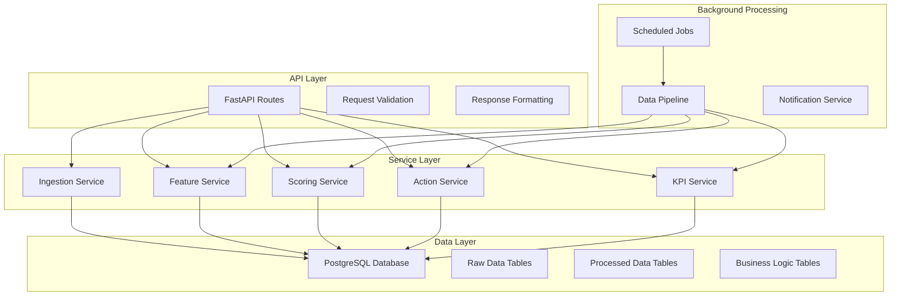

# Design Document: ExpiryShield Backend System

## Overview

The ExpiryShield backend is a FastAPI-based system that processes inventory data to predict expiry risks and recommend preventive actions. The system follows a layered architecture with clear separation between data ingestion, processing, decision-making, and API layers. It handles messy real-world data inputs and provides actionable recommendations to prevent inventory losses.

The backend serves as the core intelligence layer, processing uploaded inventory data through feature engineering, risk scoring, and action generation pipelines. It exposes RESTful APIs for frontend integration and maintains comprehensive audit trails for business intelligence.

## Architecture

The system follows a modular architecture with these key layers:



**Key Architectural Principles:**
- **Separation of Concerns**: Each service handles a specific business domain
- **Data Pipeline Architecture**: Raw data flows through validation, processing, and analysis stages
- **API-First Design**: All functionality exposed through well-defined REST endpoints
- **Async Processing**: Background jobs handle computationally intensive operations
- **Audit Trail**: Complete tracking of all actions and outcomes for business intelligence

## Components and Interfaces

### API Layer Components

**Upload Controller** (`routes_upload.py`)
- Handles file uploads with validation
- Supports CSV and Excel formats
- Provides column mapping assistance
- Returns data health reports

**Risk Controller** (`routes_risk.py`)
- Exposes risk assessment data
- Supports filtering by store, category, date range
- Provides batch-level and aggregate risk metrics

**Action Controller** (`routes_actions.py`)
- Manages action recommendations
- Handles action approvals and status updates
- Tracks action outcomes and effectiveness

**KPI Controller** (`routes_kpis.py`)
- Provides business metrics and dashboards
- Calculates savings and performance indicators
- Supports historical trend analysis

### Service Layer Components

**Ingestion Service** (`ingestion.py`)
- Validates and normalizes uploaded data
- Handles column mapping and data type conversion
- Manages duplicate detection and resolution
- Generates data quality reports

**Feature Service** (`features.py`)
- Calculates rolling sales velocities (7, 14, 30 days)
- Computes seasonality and volatility metrics
- Generates store-SKU performance profiles
- Maintains feature freshness tracking

**Scoring Service** (`scoring.py`)
- Implements baseline risk scoring algorithm
- Calculates expected sales before expiry
- Generates 0-100 risk scores for all batches
- Supports ML model integration for enhanced scoring

**Action Service** (`actions.py`)
- Evaluates transfer opportunities between stores
- Calculates optimal markdown percentages
- Estimates savings and recovery values
- Generates ranked action recommendations

**KPI Service** (`kpis.py`)
- Aggregates business metrics across time periods
- Calculates prevented losses and freed capital
- Tracks action effectiveness and ROI
- Generates executive dashboards

### Data Layer Schema

**Raw Data Tables:**
```sql
-- Stores uploaded files and processing status
raw_uploads (
    id SERIAL PRIMARY KEY,
    uploaded_at TIMESTAMP,
    file_name VARCHAR(255),
    file_type VARCHAR(50),
    status VARCHAR(50),
    validation_report JSONB
);

-- Daily sales transactions
sales_daily (
    id SERIAL PRIMARY KEY,
    date DATE,
    store_id VARCHAR(50),
    sku_id VARCHAR(100),
    units_sold INTEGER,
    selling_price DECIMAL(10,2),
    upload_id INTEGER REFERENCES raw_uploads(id)
);

-- Inventory snapshots by batch
inventory_batches (
    id SERIAL PRIMARY KEY,
    snapshot_date DATE,
    store_id VARCHAR(50),
    sku_id VARCHAR(100),
    batch_id VARCHAR(100),
    expiry_date DATE,
    on_hand_qty INTEGER,
    unit_cost DECIMAL(10,2),
    upload_id INTEGER REFERENCES raw_uploads(id)
);
```

**Processed Data Tables:**
```sql
-- Computed features for store-SKU combinations
features_store_sku (
    id SERIAL PRIMARY KEY,
    date DATE,
    store_id VARCHAR(50),
    sku_id VARCHAR(100),
    velocity_7d DECIMAL(8,2),
    velocity_14d DECIMAL(8,2),
    velocity_30d DECIMAL(8,2),
    volatility DECIMAL(6,4),
    seasonality_flag BOOLEAN,
    last_updated TIMESTAMP
);

-- Risk assessment for each batch
batch_risk (
    id SERIAL PRIMARY KEY,
    snapshot_date DATE,
    store_id VARCHAR(50),
    sku_id VARCHAR(100),
    batch_id VARCHAR(100),
    days_to_expiry INTEGER,
    expected_sales_to_expiry DECIMAL(8,2),
    at_risk_units INTEGER,
    at_risk_value DECIMAL(10,2),
    risk_score INTEGER CHECK (risk_score >= 0 AND risk_score <= 100),
    created_at TIMESTAMP DEFAULT NOW()
);
```

**Business Logic Tables:**
```sql
-- Action recommendations and tracking
actions (
    action_id SERIAL PRIMARY KEY,
    created_at TIMESTAMP DEFAULT NOW(),
    action_type VARCHAR(20) CHECK (action_type IN ('TRANSFER', 'MARKDOWN', 'LIQUIDATE')),
    from_store VARCHAR(50),
    to_store VARCHAR(50),
    sku_id VARCHAR(100),
    batch_id VARCHAR(100),
    qty INTEGER,
    discount_pct DECIMAL(5,2),
    expected_savings DECIMAL(10,2),
    status VARCHAR(20) DEFAULT 'PROPOSED' CHECK (status IN ('PROPOSED', 'APPROVED', 'DONE', 'REJECTED'))
);

-- Measured outcomes of completed actions
action_outcomes (
    id SERIAL PRIMARY KEY,
    action_id INTEGER REFERENCES actions(action_id),
    measured_at TIMESTAMP,
    recovered_value DECIMAL(10,2),
    cleared_units INTEGER,
    notes TEXT
);
```

### Interface Specifications

**File Upload Interface:**
```python
class FileUploadRequest(BaseModel):
    file_type: str  # "sales", "inventory", "purchases"
    column_mapping: Optional[Dict[str, str]] = None
    duplicate_handling: str = "skip"  # "skip", "overwrite", "merge"

class FileUploadResponse(BaseModel):
    upload_id: int
    status: str
    records_processed: int
    validation_report: Dict[str, Any]
    data_health_score: float
```

**Risk Assessment Interface:**
```python
class RiskFilter(BaseModel):
    store_ids: Optional[List[str]] = None
    categories: Optional[List[str]] = None
    min_risk_score: Optional[int] = None
    days_to_expiry_max: Optional[int] = None

class BatchRisk(BaseModel):
    store_id: str
    sku_id: str
    batch_id: str
    expiry_date: date
    risk_score: int
    at_risk_units: int
    at_risk_value: Decimal
    recommended_actions: List[str]
```

**Action Management Interface:**
```python
class ActionRecommendation(BaseModel):
    action_type: str
    priority: int
    expected_savings: Decimal
    confidence_score: float
    implementation_details: Dict[str, Any]

class ActionUpdate(BaseModel):
    action_id: int
    status: str
    notes: Optional[str] = None
    actual_outcome: Optional[Dict[str, Any]] = None
```

## Data Models

### Core Business Entities

**Store Model:**
- Represents retail locations or warehouses
- Contains location metadata and performance characteristics
- Links to inventory and sales data

**SKU (Stock Keeping Unit) Model:**
- Represents unique products with consistent attributes
- Contains category, pricing, and lifecycle information
- Links to sales velocity and risk assessments

**Batch Model:**
- Represents specific inventory lots with expiry dates
- Contains quantity, cost, and location information
- Central to risk assessment and action recommendations

**Action Model:**
- Represents recommended or executed business actions
- Contains type, parameters, and outcome tracking
- Enables closed-loop learning and optimization

### Data Flow Models

**Ingestion Pipeline:**
```
Raw Upload → Validation → Column Mapping → Data Cleaning → Storage
```

**Processing Pipeline:**
```
Raw Data → Feature Engineering → Risk Scoring → Action Generation → KPI Updates
```

**Action Lifecycle:**
```
Generated → Proposed → Approved → Executed → Measured → Analyzed
```

### Data Validation Rules

**Sales Data Validation:**
- Date must be within reasonable range (not future, not too old)
- Units sold must be non-negative
- Store and SKU IDs must exist in master data
- Selling price should be within expected ranges

**Inventory Data Validation:**
- Expiry date must be future-dated for active inventory
- Quantities must be non-negative
- Batch IDs must be unique within store-SKU combinations
- Unit costs should be positive and reasonable

**Action Data Validation:**
- Transfer actions require valid source and destination stores
- Markdown percentages must be within business policy limits
- Expected savings calculations must be positive
- Action types must match available business processes

## Correctness Properties

*A property is a characteristic or behavior that should hold true across all valid executions of a system-essentially, a formal statement about what the system should do. Properties serve as the bridge between human-readable specifications and machine-verifiable correctness guarantees.*

Now I need to analyze the acceptance criteria to determine which ones can be tested as properties:

### Property 1: File Processing Completeness
*For any* uploaded file, the system should validate format and structure, generate detailed validation reports for any errors, and upon successful processing, store raw data with complete upload confirmation and data health metrics.
**Validates: Requirements 1.1, 1.3, 1.5**

### Property 2: Column Mapping Intelligence  
*For any* set of column names that don't match expected schema, the system should provide intelligent mapping suggestions based on semantic similarity and common naming patterns.
**Validates: Requirements 1.2**

### Property 3: Duplicate Handling Consistency
*For any* dataset containing duplicate records, the system should apply the configured duplicate handling rules consistently across all duplicates without missing any instances.
**Validates: Requirements 1.4**

### Property 4: Risk Assessment Accuracy
*For any* inventory batch with expiry date and sales history, the system should calculate accurate days to expiry, generate rolling velocity averages, predict expected sales, calculate monetary risk value, and assign a valid risk score between 0-100.
**Validates: Requirements 2.1, 2.2, 2.3, 2.4, 2.5**

### Property 5: Action Recommendation Completeness
*For any* at-risk batch, the action engine should evaluate all applicable action types (transfer, markdown, liquidation), calculate expected savings and costs, and provide complete recommendations with confidence estimates.
**Validates: Requirements 3.1, 3.2, 3.3, 3.4, 3.5**

### Property 6: Action Lifecycle Management
*For any* generated action, the system should maintain complete status tracking from proposal through completion, log all state changes with timestamps, record actual outcomes, and calculate prediction variance.
**Validates: Requirements 4.1, 4.2, 4.3, 4.4, 4.5**

### Property 7: KPI Calculation Consistency
*For any* inventory state and time period, the system should calculate consistent KPI metrics including at-risk value, prevented losses, cash flow impact, turnover improvements, and provide real-time dashboard data with historical trends.
**Validates: Requirements 5.1, 5.2, 5.3, 5.4, 5.5**

### Property 8: API Endpoint Reliability
*For any* valid API request, the system should provide consistent responses with proper validation, filtering capabilities, and error handling across all endpoints (upload, risk, actions, KPIs).
**Validates: Requirements 6.1, 6.2, 6.3, 6.4, 6.5**

### Property 9: Data Integrity Preservation
*For any* data processing operation, the system should maintain separation between raw and processed data, preserve referential integrity across all tables, and support complete export of critical business data.
**Validates: Requirements 7.1, 7.2, 7.5**

### Property 10: Batch Processing Completeness
*For any* scheduled processing run, the system should execute feature calculations for all active stores, update risk scores for all batches, generate actions based on current data, refresh all KPI metrics, and handle any processing failures with proper logging and notifications.
**Validates: Requirements 8.1, 8.2, 8.3, 8.4, 8.5**

## Error Handling

The system implements comprehensive error handling across all layers:

### Input Validation Errors
- **File Format Errors**: Invalid file types, corrupted files, unsupported encodings
- **Data Validation Errors**: Missing required fields, invalid data types, constraint violations
- **Business Rule Violations**: Negative quantities, future sales dates, invalid store-SKU combinations

### Processing Errors
- **Calculation Errors**: Division by zero in velocity calculations, invalid date arithmetic
- **Data Consistency Errors**: Missing reference data, orphaned records, constraint violations
- **Resource Errors**: Database connection failures, memory limitations, timeout conditions

### Integration Errors
- **API Errors**: Invalid request formats, authentication failures, rate limiting
- **Database Errors**: Connection timeouts, transaction conflicts, constraint violations
- **External Service Errors**: File storage failures, notification service outages

### Error Response Strategy
- **Graceful Degradation**: System continues operating with reduced functionality when possible
- **Detailed Error Messages**: Clear, actionable error descriptions for debugging and user guidance
- **Error Logging**: Comprehensive logging with correlation IDs for troubleshooting
- **Retry Logic**: Automatic retry for transient failures with exponential backoff
- **Circuit Breaker**: Protection against cascading failures in external dependencies

## Testing Strategy

The testing strategy employs a dual approach combining unit tests for specific scenarios and property-based tests for comprehensive validation:

### Unit Testing Approach
- **Component Testing**: Individual service classes tested in isolation with mocked dependencies
- **Integration Testing**: API endpoints tested with real database connections and data flows
- **Edge Case Testing**: Boundary conditions, empty datasets, extreme values, and error conditions
- **Business Logic Testing**: Specific examples that demonstrate correct calculations and decision-making

### Property-Based Testing Approach
- **Universal Property Validation**: Each correctness property implemented as property-based tests
- **Comprehensive Input Coverage**: Randomized test data generation covering valid input spaces
- **Invariant Testing**: Properties that must hold regardless of input variations
- **Round-Trip Testing**: Data serialization, processing pipelines, and calculation reversibility

### Testing Configuration
- **Property Test Iterations**: Minimum 100 iterations per property test to ensure statistical confidence
- **Test Data Generation**: Smart generators that create realistic business scenarios
- **Property Test Tagging**: Each test tagged with format: **Feature: inventory-expiry-prevention, Property {number}: {property_text}**
- **Failure Analysis**: Systematic analysis of property test failures to distinguish between implementation bugs, test errors, and specification gaps

### Test Environment Setup
- **Database Testing**: Isolated test database with realistic schema and constraints
- **Mock External Services**: Controlled testing of external dependencies and failure scenarios
- **Performance Testing**: Load testing for batch processing and API response times
- **End-to-End Testing**: Complete workflows from data upload through action execution

The testing strategy ensures both correctness of individual components and system-wide behavioral properties, providing confidence in the system's reliability and business value delivery.